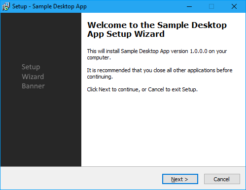
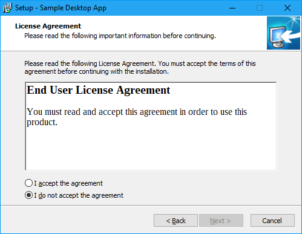

# DesktopApp
Sample Windows Forms desktop application with a class library project. Inno Setup script file installs tha application, creates a desktop shortcut and an uninstall shortcut in Add/Remove Programs.

Setup wizard also displays a license agreement page with a sample licence agreement document. Setup script and addtional files are under 'Setup' folder.

Sample setup wizard screenshots

