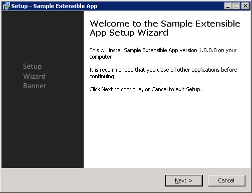
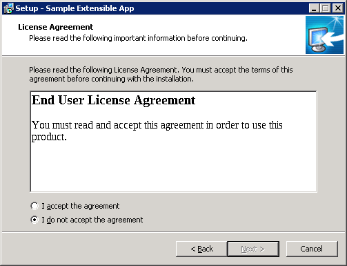
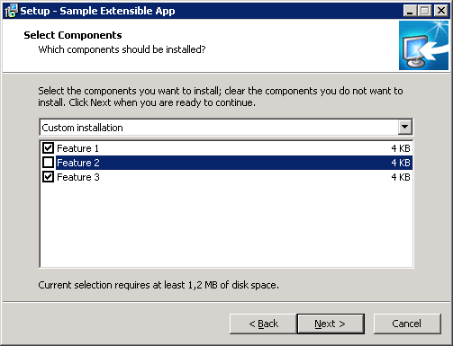
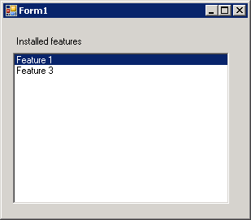

# Optional Features App
Sample Windows Forms desktop application with a class library project. Inno Setup script file installs tha application, creates a desktop shortcut and an uninstall shortcut in Add/Remove Programs. This script file has an addtionla step of selecting optional components.

Setup wizard also displays a license agreement page with a sample licence agreement document. Setup script and addtional files are under 'Setup' folder.

## Sample setup wizard screenshots

Initial wizard page

EULA page

Feature (optional component) selection page

Sample application ran after installation (Feature 1 and Feature 3 selected, Feature 2 deselected during the installation)

