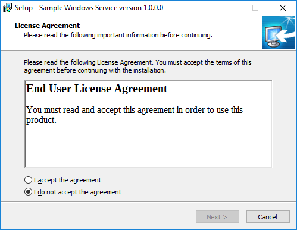
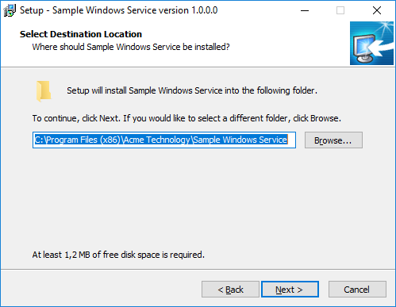
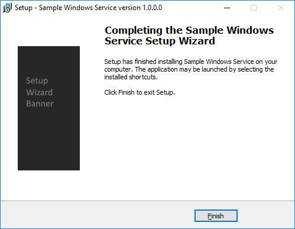

# Windows Service
Simple Windows service project that writes a mesage to the console periodically. In debug mode it runs as a console application and in release mode it runs as a windows service. Inno Script file installs and registers the service.

Sample setup wizard screenshots

