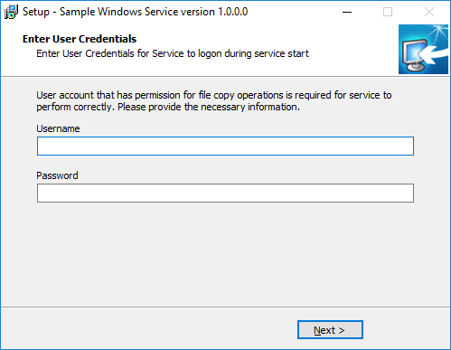

# Windows Service With Login
Sample Windows service which runs with a user account instead of local system accounts. Inno Setup script displays additional setup wizard page for entering user account name and password, and sets the Windows service's user account.

This setup wizard has an additional page for entering the user credentials.

